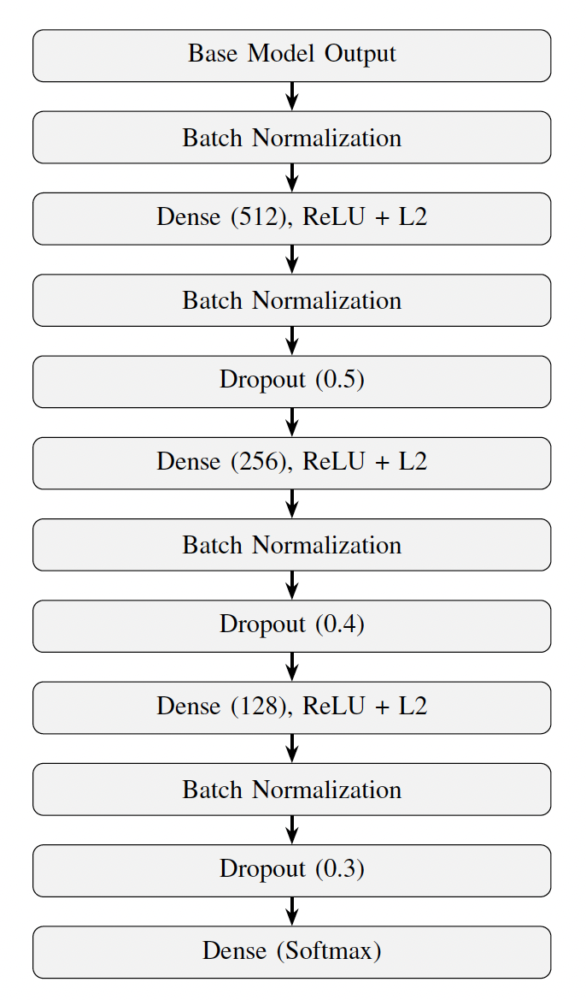
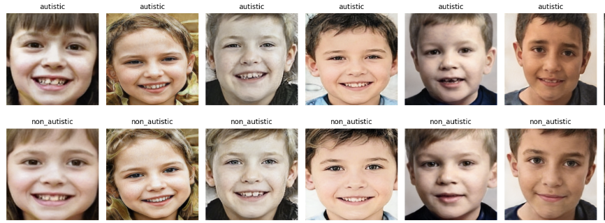
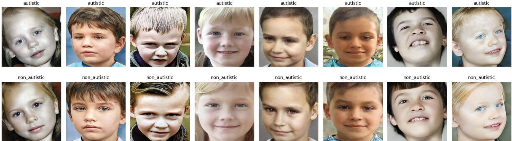
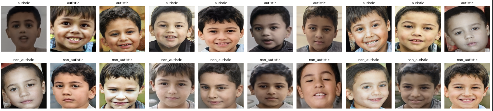
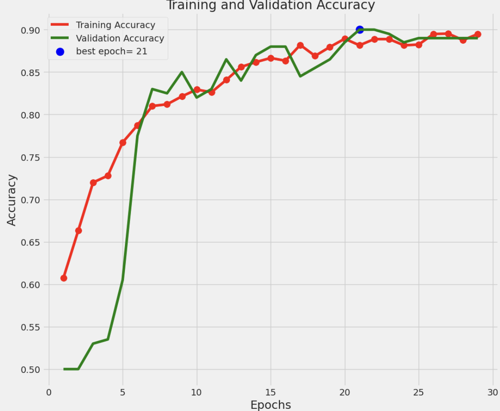
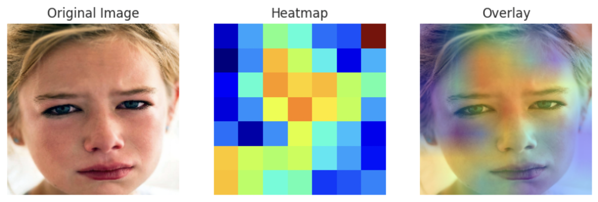

# Leveraging Generative AI to Generate and Detect Autistic Facial Expressions  

## 🔹 Overview  
This project explores using **Generative Adversarial Networks (GANs)** and **Deep Learning classifiers** to generate and detect autistic facial expressions. The goal is to both expand underrepresented and limited datasets (especially Middle Eastern children) and improve early detection of autism through automated image classification.  

---

## 📌 Problem Statement  
Autism diagnosis often relies on behavioral assessments and interviews that can be subjective, time-consuming, and vary across cultures.  
This project investigates whether AI can:  
1. **Generate synthetic facial images** representing autistic and non-autistic traits to expand limited datasets.  
2. **Classify faces** into autistic and non-autistic categories using transfer learning.  

---

## 📊 Dataset  
- **Total size:** ~1,200+ images per class (`autistic`, `non_autistic`).  
- **Sources:** Public datasets from Kaggle + curated middle eastern samples from selected Youtube frames and Google images to be used during fine tuning
- **Challenges:** Limited representation of Middle Eastern children (~50 images initially).  

**Preprocessing:**  
- Resized to **512×512** for generation GAN model training., and **224×224** for classification model training.
- Augmented with flips, rotations, and slight color adjustments using ImageDataGenerator  
- Balanced classes before classifier and generation training.  

---

## ⚙️ Methods  

### 1. Generative Modeling  
- **Model:** [StyleGAN2-ADA](https://github.com/NVlabs/stylegan2-ada)  
- **Training setup:**  
  - Image size: 512×512
  - Initially trained on the initial dataset for 1 week for 25000kimgs
  - Fine-tuned for 5 days on the Middle Eastern dataset  
  - Mixed dataset (400 images per class, including augmentations + Middle Eastern samples)  
- **Results:** Achieved **FID = 14.7**, with realistic synthetic faces.  

### 2. Classification  
- **Model:** EfficientNetB3 (transfer learning)
- **Model Head Architecture:**
    
- **Training:**
  - Custom train/validation/test splits via Pandas DataFrames
  - Removed problematic, excessively blurry images using a blur detection algorithm based on the LaPlacian Variance
  - Applied different augmentations and normalization techniques to the images before starting the training process
  - Standardized input features  
  - Loss: Categorical cross-entropy  
  - Optimizer: Adam  
- **Results:** Best model (EfficientNetB3) reached **92% accuracy** on unseen test data.  

---

## 📈 Results  

### GAN Outputs  
*(Synthetic examples generated with StyleGAN2-ADA with **trunc=0.7**)*  
  

*(Synthetic examples generated with StyleGAN2-ADA with **trunc=1**)*  
  

*(Synthetic Middle Eastern examples generated with StyleGAN2-ADA with **trunc=0.7**)*  
  

### Training Curves  
*(Accuracy across epochs)*  
  

*(Loss across epochs)*  
  

### Explainable AI (XAI) Interpretation 
*(GRAD-CAM)*  
  

### Classifier Performance  
- **Validation Accuracy:** 90%  
- **Test Accuracy:** 92%  
- **Observation:** Model captured subtle facial cues but struggled with underrepresented ethnic groups.  

---

## 🔑 Key Findings  
- GAN-generated images improved dataset diversity, though ethnic imbalance remained a challenge.  
- EfficientNet models were able to detect autistic vs. non-autistic features with high accuracy.  
- Balancing and standardizing the dataset was critical to stability and fairness.  

---

